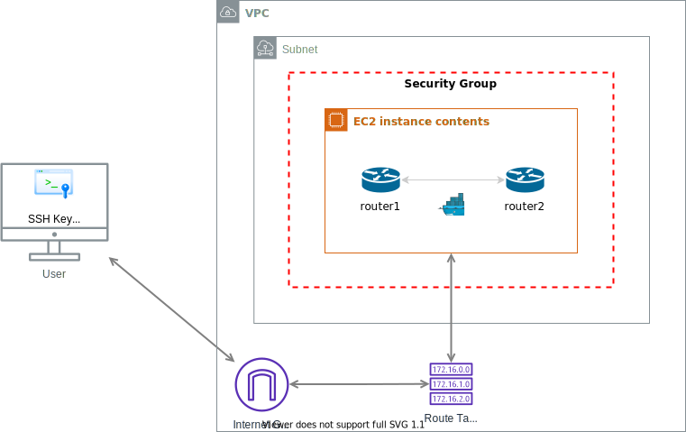

# Automating a testing environment setup on AWS

Cloud resources are expensive, you only want to pay for them while your are using them. 
If you only run tests or work on demos for a couple of hours per day, it makes a sense to shutdown all resources for the rest of the day to save on costs.

If you want to resume work or start fresh, your setup should ideally be re-created consistently and then destroyed with a single click of a button. 
That's where automation comes in.

A [Playbook](create-EC2-testbed.yml) example is included in this repository to illustrate how a Testbed environment can be automatically be provisioned for a particular use-case.
In this scenario, we create a virtual machine (VM) in AWS that is ready to run containerized multi-vendor network topologies. 
The diagram below is a representation of the end-goal, that shows the AWS resources that need to be present otherwise created. 
It also hints about Software requirements that will be installed, as well as providing pre-built network topology samples. 

<p align="center">

</p>

## Requirements

Ansible 2.9+ needs to be [installed](https://docs.ansible.com/ansible/latest/installation_guide/intro_installation.html#installing-ansible-with-pip) in your computer to run this example. [Python3](https://wiki.python.org/moin/BeginnersGuide/Download) as well.

```bash
python -m pip install --user ansible
```

### Python libraries

As we will interact with AWS, we need a couple of Python libraries to be present in the system.

```bash
pip3 install --user boto3 botocore
```

### Ansible Collections

We will also need the Ansible [Amazon AWS Collection](https://github.com/ansible-collections/amazon.aws#amazon-aws-collection).

```bash
ansible-galaxy collection install -r collections/requirements.yml
```

## Creating the testbed

Follow these steps to provision the testbed.

1. Clone this repository: `git clone https://github.com/nleiva/aws-testbed.git`

2. Make your [AWS account credentials](https://docs.aws.amazon.com/general/latest/gr/aws-sec-cred-types.html#access-keys-and-secret-access-keys) (`AWS_ACCESS_KEY` and `AWS_SECRET_KEY`) available as environment variables (`export`).

```bash
export AWS_ACCESS_KEY='...'
export AWS_SECRET_KEY='...'
```

3. Run the [Playbook](create-EC2-testbed.yml) and wait a couple of minutes while a VM is provisioned and the software is installed:

```bash
 ⇨  ansible-playbook create-EC2-testbed.yml -v

<snip>

TASK [Print out SSH access details] ***********************************************************************************************************************************************************
ok: [testbed-fedora34] => {
    "msg": "ssh -i testbed-private.pem fedora@ec2-54-175-179-XXX.compute-1.amazonaws.com"
}

RUNNING HANDLER [configure_instance : Reboot machine] *****************************************************************************************************************************************
changed: [testbed-fedora34] => {"changed": true, "elapsed": 22, "rebooted": true}

PLAY RECAP ************************************************************************************************************************************************************************************
localhost                  : ok=25   changed=7    unreachable=0    failed=0    skipped=1    rescued=0    ignored=0   
testbed-fedora34           : ok=33   changed=22   unreachable=0    failed=0    skipped=0    rescued=0    ignored=0    
```

You can now access the VM as displayed in the logs, for example: `ssh -i testbed-private.pem fedora@ec2-54-175-179-XXX.compute-1.amazonaws.com`.

### Linux distribution

You can select either Fedora (34) or Ubuntu (20.04) by passing the variable `aws_distro` to the [Playbook](create-EC2-testbed.yml). By default it selects `fedora`.

You would run the [Playbook](create-EC2-testbed.yml) as follows, if you preferred to run an `ubuntu` machine. 

```bash
ansible-playbook create-EC2-testbed.yml -v --extra-vars "aws_distro=ubuntu"
```

### Instance type

You can select any instance type you prefer, based on your vCPU/Memory requirements, and price constrains. By default it selects `t2.micro`. Check out [On-Demand Plans for Amazon EC2](https://aws.amazon.com/ec2/pricing/on-demand/) for reference. Some examples:

Instance name | On-Demand hourly rate | vCPU | Memory
--- | --- | --- | ---
t3.medium | $0.0416 | 2 | 4 GiB
m5.large | $0.096 | 2 | 8 GiB
t3.xlarge | $0.1664 | 4 | 16 GiB
m4.xlarge | $0.2 | 4 | 16 GiB
r5.xlarge | $0.252 | 4 | 32 GiB
m5.2xlarge | $0.384 | 8 | 32 GiB
r5.2xlarge | $0.504 | 8 | 64 GiB
c5.metal | $4.08 | 96 | 192 GiB

You would run the [Playbook](create-EC2-testbed.yml) as follows, if you preferred to run a `m5.large` instance. 

```bash
ansible-playbook create-EC2-testbed.yml -v --extra-vars "instance_type=m5.large"
```

To run the Containerlab's Firecracker micro-VMs [mode of operation](https://containerlab.srlinux.dev/manual/kinds/cvx/#mode-of-operation), you need nested virtualization support, which regular AWS instances don't provide ([Cloud Provider Instances with KVM support](https://ignite.readthedocs.io/en/stable/cloudprovider/)), so you would need to select a [bare metal instance type](https://aws.amazon.com/about-aws/whats-new/2018/05/announcing-general-availability-of-amazon-ec2-bare-metal-instances/). 

Note1: `a1.metal` is the cheapest bare metal instance. However, its architecture is `arm64`, not `x86_64` (it affect the image type you select).

Note2: Rebooting a [bare metal instance](https://aws.amazon.com/about-aws/whats-new/2018/05/announcing-general-availability-of-amazon-ec2-bare-metal-instances/) takes considerably longer than a regular EC2 instance.

### Volume type

The volume type is also configurable, check out [Amazon EBS pricing](https://aws.amazon.com/ebs/pricing/). The default is `gp2`.

Volume Type | Price
--- | ---
General Purpose SSD (gp3) - Storage	| $0.08/GB-month
General Purpose SSD (gp2) Volumes | $0.10 per GB-month of provisioned storage

To select a different type, use the variable `volume_type`.

```bash
ansible-playbook create-EC2-testbed.yml -v --extra-vars "instance_type=m5.large volume_type=gp3"
```

## Running a network topology

Once in the VM, you can run any of the examples of the [lab folder](lab) in the VM's `$HOME` directory. [Containerlab](https://github.com/srl-labs/containerlab) is already installed and does all the magic here. For example, a simple topology with two [FRR](https://frrouting.org/) routers connected back-to-back as described in [lab/frr](lab/frr/topology.yml) can be instantiated as follows:

```bash
cd lab/frr
sudo clab deploy --topo topology.yml
```

<p align="center">
  <br>
</p>

The routers are [pre-configured](lab/frr/router1/frr.cfg) with a BGP session running between them. To access router1 for example:

```bash
docker exec -it clab-mylab-router1 vtysh
```

[More details](lab/README.md) about Topology creation.

## Deleting the test VM

As important as creating the VM, is being able to delete it. You can do this by running:

```bash
ansible-playbook delete-EC2-testbed.yml -v
```

For a specific Linux distribution:

```bash
ansible-playbook delete-EC2-testbed.yml -v --extra-vars "aws_distro=ubuntu"
```

## Deleting all AWS resources created

This is optional. You can remove VPC, Subnet, Security Group, SSH Key Pair, and Internet Gateway.

```bash
ansible-playbook delete-AWS-resources.yml -v
```

If you used a non-default prefix, then:

```bash
ansible-playbook delete-AWS-resources.yml -v -e "aws_prefix=another"
```
