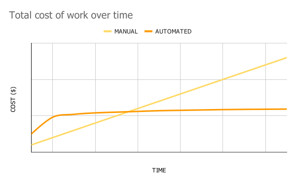

# Automating a testing environment setup on AWS

Cloud resources are expensive, you only want to pay for them while your are using them. 
If you only run tests or work on demos for a couple of hours per day, it makes a sense to shutdown all resources for the rest of the day to save on costs.

If you want to resume work or start fresh, your setup should ideally be re-created consistently and then destroyed with a single click of a button. 
That's where automation comes in.

<p align="center">
  <br>
</p>

A [Playbook](create-EC2-Fedora-34.yml) example is included to automatically create a virtual machine (VM) in AWS that is ready to run containerized multi-vendor network topologies. 
The diagram below is a representation of the end-goal of this of this repository.
All the AWS resources needed are provisioned as part of the process.
Software requirements install and adding test examples to the VM are also considered. 

<p align="center">

</p>

## Requirements

Ansible 2.9+ needs to be [installed](https://docs.ansible.com/ansible/latest/installation_guide/intro_installation.html#installing-ansible-with-pip) in your computer to run this example. [Python3](https://wiki.python.org/moin/BeginnersGuide/Download) as well.

```bash
python -m pip install --user ansible
```

### Python libraries

As we will interact with AWS, we need a couple of Python libraries to be present in the system.

```bash
pip3 install --user boto3 botocore
```

### Ansible Collections

We will also need the Ansible [Amazon AWS Collection](https://github.com/ansible-collections/amazon.aws#amazon-aws-collection).

```bash
ansible-galaxy collection install -r collections/requirements.yml
```

## Creating the test VM

Follow this steps to provision the test VM.

1. Clone this repository: `git clone https://github.com/nleiva/aws-testbed.git`

2. Make your [AWS account credentials](https://docs.aws.amazon.com/general/latest/gr/aws-sec-cred-types.html#access-keys-and-secret-access-keys) (`AWS_ACCESS_KEY` and `AWS_SECRET_KEY`) available as environment variables (`export`).

```bash
export AWS_ACCESS_KEY='...'
export AWS_SECRET_KEY='...'
```

3. Run the [Playbook](create-EC2-Fedora-34.yml) and wait a couple of minutes while the VM is provisioned and the software is installed:

```bash
ansible-playbook create-EC2-Fedora-34.yml -v

<snip>

TASK [Print out SSH access details] *********************************************************************************************************************************************
ok: [Fedora34] => {
    "msg": "ssh -i Fedora34-private.pem fedora@ec2-3-236-234-XXX.compute-1.amazonaws.com"
}

RUNNING HANDLER [configure_instance : Reboot machine] ***************************************************************************************************************************
changed: [Fedora34] => {"changed": true, "elapsed": 23, "rebooted": true}

PLAY RECAP **********************************************************************************************************************************************************************
Fedora34                   : ok=33   changed=22   unreachable=0    failed=0    skipped=0    rescued=0    ignored=0   
localhost                  : ok=23   changed=2    unreachable=0    failed=0    skipped=1    rescued=0    ignored=0   
```

You can now access the VM as displayed in the logs, for example: `ssh -i Fedora34-private.pem fedora@ec2-3-236-234-XXXS.compute-1.amazonaws.com`.

### Instance type

You can select any instance type you prefer, based on your vCPU/Memory requirements, and price constrains. By default it selects `t3.medium`. Check out [On-Demand Plans for Amazon EC2](https://aws.amazon.com/ec2/pricing/on-demand/) for reference. Some examples:

Instance name | On-Demand hourly rate | vCPU | Memory
--- | --- | --- | ---
t3.medium | $0.0416 | 2 | 4 GiB
m5.large | $0.096 | 2 | 8 GiB

You would run the Playbook like this instead, if you preferred to run a `m5.large` instance. 

```bash
ansible-playbook create-EC2-Fedora-34.yml -v --extra-vars "instance_type=m5.large"
```

### Volume type

The volume type is also configurable, check out [Amazon EBS pricing](https://aws.amazon.com/ebs/pricing/). The default is `gp2`.

Volume Type | Price
--- | ---
General Purpose SSD (gp3) - Storage	| $0.08/GB-month
General Purpose SSD (gp2) Volumes | $0.10 per GB-month of provisioned storage

To select a different type, use the variable `volume_type`.

```bash
ansible-playbook create-EC2-Fedora-34.yml -v --extra-vars "instance_type=m5.large volume_type=gp3"
```

## Running a network topology

Once in the VM, you can run any of the examples in the [lab folder](lab) in the `$HOME` directory. [Containerlab](https://github.com/srl-labs/containerlab) is installed and does all the magic here. For example, a simple topology with two [FRR](https://frrouting.org/) routers connected back-to-back as described in [lab/frr/](lab/frr/topology.yml) can be run by changing directory (`cd lab/frr/`) and executing from there:

```bash
sudo clab deploy --topo topology.yml
```

<p align="center">
  <br>
</p>

The routers are [pre-configured](lab/frr/router1/frr.cfg) with a BGP session running between them. To access router1 for example:

```bash
docker exec -it clab-mylab-router1 vtysh
```

[More details](lab/README.md)

## Deleting the test VM

As important as creating the VM, is being able to delete it. You can do this by running:

```bash
ansible-playbook delete-EC2-Fedora-34.yml -v
```