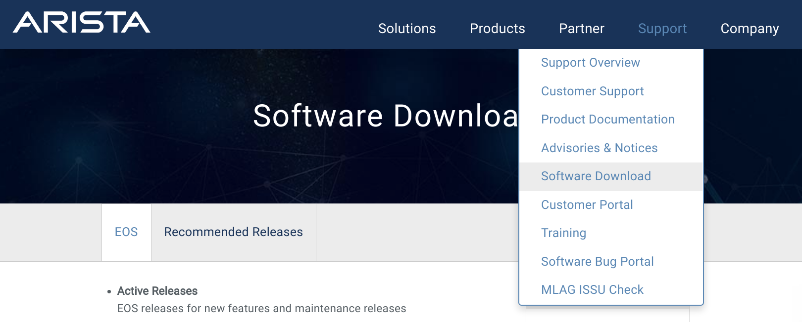
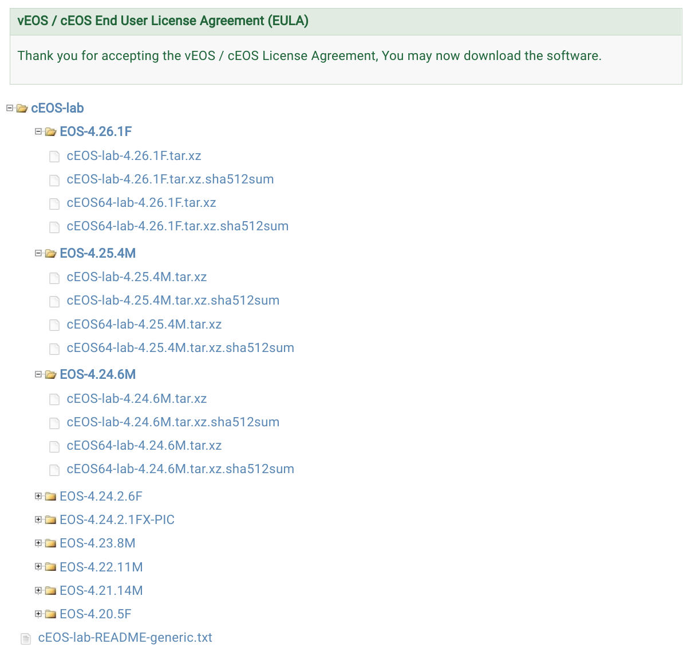

# cEOS image

## Create an account

Go to [User Registration](https://www.arista.com/en/user-registration) in their website.


If you use a nom-corporate email to register, you will get this message: "_This Username Available. (Note: You are trying to register with a non corporate email ID. In order to get customer or partner access, you must provide a corporate email ID.)_"

After registration, wait five minutes to get an email for account confirmation, and then another five to login.

## Download the container image

Once your account is confirmed, you can log in and access the [Software Download section](https://www.arista.com/en/support/software-download).

<p align="center">
  <br>
  <b>Arista Software Download section</b><br>
</p>

From there, you can download cEOS.

<p align="center">
  <br>
  <b>Download cEOS</b><br>
</p>

## Add image to your local image repository

Upload container image from your computer to EC2 instance.

```bash
scp -i Fedora34-private.pem ~/Downloads/cEOS-lab-4.25.4M.tar fedora@ec2-44-192-86-27.compute-1.amazonaws.com:/home/fedora
```

Import the image to Docker

```bash
docker import cEOS-lab-4.25.4M.tar ceos:4.25.4M
```

Note on [cEOS and cgroups v2](https://github.com/srl-labs/containerlab/issues/467)